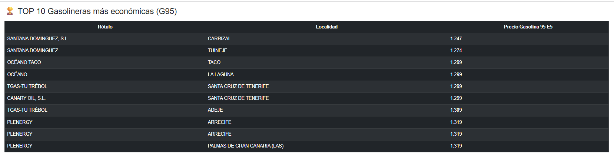

# ⛽ Canarias Gas Tracker

Mapa interactivo y **automatizado** de los precios de carburante en las Islas Canarias. Cada mañana, un proceso automático descarga los precios oficiales del Ministerio, los limpia, los compara con el día anterior y vuelve a publicar el mapa — sin intervención humana.

🔗 **Demo en vivo:** https://henry94bt.github.io/canarias-gas-tracker/



---

## ¿Por qué este proyecto?

El precio del combustible en Canarias varía notablemente entre islas y operadores por su régimen fiscal especial (IGIC en lugar de IVA) y la logística de distribución insular. La información existe — el Ministerio la publica en abierto — pero está en bruto, sin contexto y sin actualizar de forma cómoda para el consumidor.

Este proyecto convierte ese dato público en una herramienta de decisión: localizar la gasolinera más barata cerca, comparar islas y operadores, y seguir la evolución de los precios en el tiempo.

Más allá de la utilidad, es un caso práctico completo de **ingeniería de datos**: el ciclo entero de *API → limpieza → análisis → visualización → pipeline automatizado*, con datos 100 % públicos y reproducibles, y a coste cero de mantenimiento.

---

## Características

- **Mapa interactivo** con todas las estaciones de servicio de las 7 islas, agrupadas por clústeres.
- **Código de colores dinámico** por precio: las más baratas (cuartil inferior) en verde, las más caras (cuartil superior) en rojo. Los umbrales se recalculan cada día, así que el código sigue siendo válido aunque suban o bajen los precios.
- **Tabla Top 10** filtrable en vivo por isla y por tipo de combustible (Gasolina 95 / Diésel).
- **Buscador** de estación o localidad en todas las islas.
- **Variación diaria** (▲▼) en cada popup: cuánto ha subido o bajado el precio respecto al día anterior.
- **Histórico acumulado** en CSV que alimenta las comparativas y permite análisis de tendencias.
- **Actualización automática diaria** vía GitHub Actions, sin servidores.

---

## Arquitectura

El proyecto sigue un pipeline de datos clásico de tipo ETL, ejecutado de forma desatendida:

```
  API Ministerio  →  Limpieza (Pandas)  →  Análisis  →  Mapa (Folium)  →  GitHub Pages
   (datos brutos)     (tipos, nulos,        (cuartiles,   (HTML + JS)       (web pública)
                        coma→punto)          variación)
                            │                                                    ▲
                            └──────────  Histórico CSV  ──────────────────────────┘
                                         (memoria entre ejecuciones)

                    Todo orquestado por GitHub Actions (cron diario)
```

1. **Ingestión** — Se descargan los precios desde la API REST oficial del Ministerio para la Transición Ecológica (Geoportal de carburantes).
2. **Limpieza** — Se filtran las provincias 35 (Las Palmas) y 38 (Santa Cruz de Tenerife), se convierten los precios y coordenadas del formato español (coma decimal) a numérico, y se descartan registros sin coordenadas.
3. **Análisis** — Cada estación se asigna a su isla mediante una función de mapeo robusta, se calculan los umbrales de precio por cuartiles y se compara con el histórico del día anterior.
4. **Visualización** — Se genera un único archivo `index.html` autocontenido con el mapa Folium y una capa de Bootstrap + JavaScript para la tabla interactiva.
5. **Automatización** — GitHub Actions ejecuta el proceso cada día, actualiza el histórico y publica el resultado.

---

## Stack técnico

| Capa | Herramienta |
|------|-------------|
| Lenguaje | Python 3.10 |
| Datos | pandas |
| Peticiones HTTP | requests |
| Mapas | Folium (Leaflet.js) |
| Frontend tabla | Bootstrap 5 + JavaScript |
| Automatización | GitHub Actions (cron) |
| Hosting | GitHub Pages |

---

## Estructura del repositorio

```
canarias-gas-tracker/
├── .github/workflows/
│   └── actualizar_precios.yml   # Automatización diaria (cron 8:00)
├── mapa_pro.py                  # Script principal: ETL + generación del mapa
├── historico_precios.csv        # Histórico que alimenta las comparativas
├── index.html                   # Mapa publicado (generado automáticamente)
├── captura_mapa.png             # Captura para este README
└── README.md
```

---

## Cómo ejecutarlo en local

```bash
# 1. Clonar el repositorio
git clone https://github.com/henry94bt/canarias-gas-tracker.git
cd canarias-gas-tracker

# 2. Instalar dependencias
pip install requests pandas folium pytz

# 3. Ejecutar
python mapa_pro.py
```

El script genera `index.html` en la misma carpeta. Ábrelo en el navegador para ver el mapa.

> **Nota:** la API del Ministerio puede rechazar peticiones de forma intermitente. El script reintenta automáticamente hasta 3 veces antes de cancelar la ejecución; si falla, no sobrescribe los datos existentes.

---

## Decisiones técnicas

Algunas decisiones de diseño que merecen explicación:

- **Un único HTML autocontenido** en lugar de una app con backend. Es más fácil de compartir, demostrar y desplegar, y mantiene el coste de hosting en cero. La interactividad (filtros, buscador) se resuelve en JavaScript del lado del cliente.
- **Umbrales de color por cuartiles** en lugar de valores fijos. Un umbral fijo (p. ej. "rojo si > 1,45 €") queda obsoleto en cuanto cambia el nivel general de precios; los cuartiles se adaptan a la distribución de cada día.
- **Asignación de isla por coincidencia de texto** sobre el municipio, normalizado a mayúsculas, en lugar de un diccionario cerrado. Así no falla con tildes, nombres compuestos o variantes ortográficas de la fuente oficial.
- **Validación antes de publicar.** Si la API devuelve datos parciales (menos estaciones de las esperadas) o falla, el proceso se cancela con código de error en vez de publicar un mapa vacío.

---

## Roadmap

- [ ] Gráfica de evolución temporal del precio medio por isla.
- [ ] Análisis comparativo de precio medio por operador (DISA, PETROPRIX, etc.).
- [ ] Ampliar a más combustibles (Gasolina 98, GLP).
- [ ] Alertas de mínimo histórico por estación.

---

## Datos

Fuente: [Geoportal de carburantes — Ministerio para la Transición Ecológica](https://geoportalgasolineras.es/). Datos abiertos de actualización diaria.

---

*Proyecto de portafolio. Combina ingeniería de datos en Python con visión analítica de negocio aplicada a un problema real de optimización de costes en Canarias.*